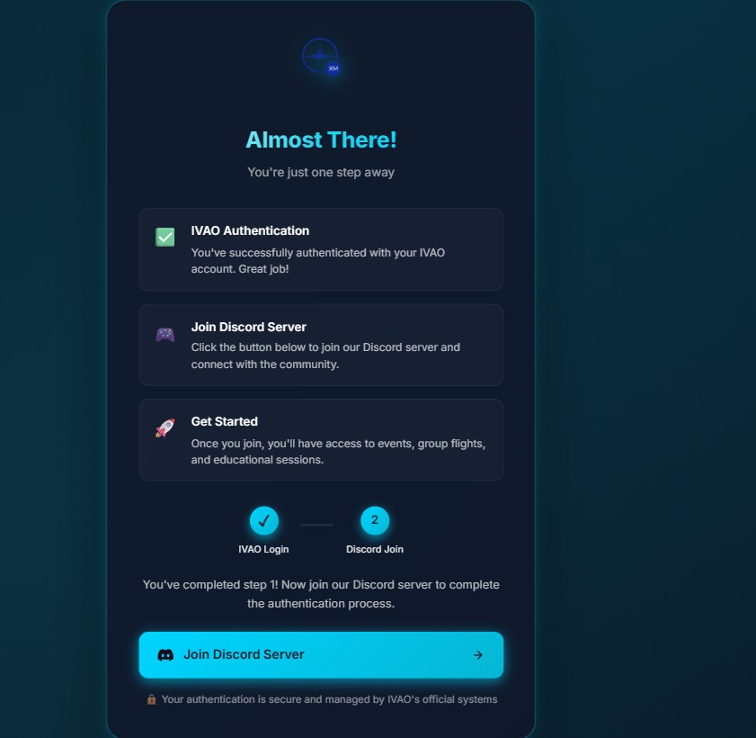
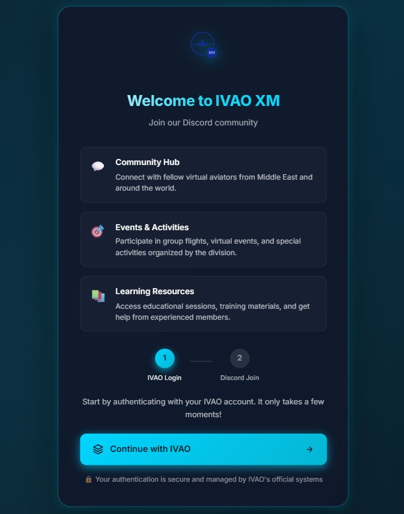

# IVAO Discord Authentication System

A modern, secure Discord authentication system for IVAO divisions using OAuth2. This system allows IVAO members to authenticate with their IVAO account and automatically join your Discord server.

## 📸 Screenshots

### Welcome Page (IVAO Login)

*Initial authentication page where users start by logging in with their IVAO account*

### Discord Join Page

*Second step where users join the Discord server after successful IVAO authentication*

## 🚀 Features

- **IVAO OAuth2 Integration**: Secure authentication using IVAO's official OAuth2 system
- **Discord OAuth2 Integration**: Seamless Discord server joining
- **Automatic Role Assignment**: Assign Discord roles based on IVAO membership status
- **Token Management**: Automatic token refresh and management
- **Modern UI**: Beautiful, responsive user interface
- **Database Integration**: MySQL/MariaDB support with connection pooling
- **Discord Bot**: Python-based bot for user verification and token management

## 📋 Requirements

### Frontend (PHP)
- PHP 7.4 or higher
- MySQL/MariaDB database
- Web server (Apache/Nginx) with mod_rewrite enabled
- PHP extensions: `pdo_mysql`, `curl`, `json`, `session`

### Backend (Python)
- Python 3.9 or higher
- pip package manager
- MySQL/MariaDB database access

## 📁 Project Structure

```
.
├── app/                       # Frontend application (PHP)
│   ├── bootstrap.php         # Application bootstrap
│   ├── config/               # Configuration files
│   ├── Controllers/          # MVC Controllers
│   ├── Core/                 # Core framework files
│   ├── Models/               # Data models
│   └── Services/             # Business logic services
├── assets/                    # Static assets
│   ├── css/                  # Stylesheets
│   └── img/                  # Images
├── backend/                  # Discord bot (Python)
│   ├── src/                 # Source code
│   │   ├── bot/             # Bot main files
│   │   ├── cogs/            # Discord bot cogs
│   │   ├── config/          # Configuration management
│   │   ├── database/        # Database models and pool
│   │   ├── services/        # Business logic services
│   │   └── utils/           # Utility functions
│   ├── docker/              # Docker configuration
│   ├── requirements.txt     # Python dependencies
│   └── start.sh             # Bot startup script
├── templates/               # HTML templates
├── screenshots/             # UI screenshots
├── index.php               # Frontend entry point
├── .htaccess               # URL rewriting rules
├── env.example            # Environment variables template
└── schema.sql             # Database schema (schema-only)
```

## 🔧 Installation

### 1. Clone or Download the Repository

```bash
git clone <your-repo-url>
cd ivao-discord-auth
```

### 2. Frontend Setup

1. **Copy files to your web server:**
   - Upload all files to your domain root (e.g., `discord.xm.ivao.aero/`)
   - Ensure `index.php` is in the document root

2. **Configure environment variables:**
   ```bash
   cp env.example .env
   ```
   Edit `.env` and fill in your values:
   ```env
   # Database Configuration
   DB_HOST=db.divisions.ivao.aero
   DB_DATABASE=xmivao_discord
   DB_USER=your_database_user
   DB_PASSWORD=your_database_password

   # IVAO OAuth Configuration
   OAUTH_CLIENT_ID=your_ivao_client_id
   OAUTH_CLIENT_SECRET=your_ivao_client_secret
   OAUTH_STATE=10

   # Discord OAuth Configuration
   DISCORD_CLIENT_ID=your_discord_client_id
   DISCORD_SECRET_ID=your_discord_secret_id
   DISCORD_BOT_TOKEN=your_discord_bot_token
   DISCORD_GUILD_ID=your_discord_guild_id

   # Application Configuration
   REDIRECT_URI=https://discord.xm.ivao.aero/
   DIV=XM
   COUNTRY=Middle East
   DIVISION_URL=https://xm.ivao.aero
   ```

3. **Set file permissions:**
   ```bash
   chmod 644 index.php .htaccess .env
   chmod -R 755 app templates assets
   ```

4. **Create database:**
   ```bash
   mysql -u root -p < schema.sql
   ```

### 3. Backend (Discord Bot) Setup

1. **Navigate to backend directory:**
   ```bash
   cd backend
   ```

2. **Create virtual environment (recommended):**
   ```bash
   python3.9 -m venv venv
   source venv/bin/activate  # On Windows: venv\Scripts\activate
   ```

3. **Install dependencies:**
   ```bash
   pip install -r requirements.txt
   ```

4. **Configure environment variables:**
   Create a `.env` file in the `backend/` directory with:
   ```env
   # Discord Bot
   DISCORD_TOKEN=your_bot_token
   BOT_ID=your_bot_id
   LOGCHANNEL_ID=your_log_channel_id
   HELP_CHANNEL_ID=your_help_channel_id
   BOTMANAGERS=user_id1,user_id2

   # IVAO OAuth
   OAUTH_CLIENT_ID=your_ivao_client_id
   OAUTH_CLIENT_SECRET=your_ivao_client_secret
   OAUTH_STATE=10

   # Database
   HOST=db.divisions.ivao.aero
   PORT=3306
   DBUSER=your_database_user
   PASSWORD=your_database_password
   DATABASE=xmivao_discord

   # Division Configuration
   DIV=XM
   COUNTRY=Middle East
   LANGUAGE=en
   ICONURL=https://your-division-icon-url.com/icon.png
   
   # Role IDs (Discord role IDs)
   DIV_STAFF=role_id
   DIV_HQ=role_id
   VID_VERIFIED=role_id
   DIV_MEMBER=role_id
   # ... (add other role IDs as needed)
   ```

5. **Run the bot:**
   
   **Option 1: Run directly:**
   ```bash
   python -m src.bot.main
   ```
   
   **Option 2: Run in background with screen (recommended for production):**
   ```bash
   screen -dmS discord python3.9 -m src.bot.main
   ```
   To reattach to the screen session: `screen -r discord`
   To detach from screen: Press `Ctrl+A` then `D`
   
   **Option 3: Use the startup script:**
   ```bash
   chmod +x start.sh
   ./start.sh
   ```

## 🔐 Security Notes

- **Never commit `.env` files** - They contain sensitive credentials
- **The SQL file (`schema.sql`) is schema-only** - No user data is included
- **All secrets are loaded from environment variables** - No hardcoded credentials
- **Use HTTPS in production** - OAuth2 requires secure connections

## 🐳 Docker Support

The backend includes Docker configuration. See `backend/docker/` for details.

## 📝 Configuration

### Frontend Configuration

All configuration is done through environment variables in `.env`. See `env.example` for all available options.

### Backend Configuration

The Discord bot uses environment variables for all configuration. See the backend `.env` setup above.

## 🛠️ Development

### Frontend Development

1. Enable debug mode in `index.php`:
   ```php
   $debug_mode = true;
   ```

2. Clear cache (if using opcache):
   ```
   https://your-domain.com/?clear_cache=1
   ```

### Backend Development

1. Enable debug mode:
   ```bash
   export DEBUG=true
   python -m src.bot.main
   ```

## 📚 API Documentation

### Frontend Routes

- `/` - Main authentication page
- `/auth/callback` - IVAO OAuth callback
- `/discord/callback` - Discord OAuth callback
- `/success` - Success page after authentication

### Discord Bot Commands

- `/refreshtokens` - Refresh IVAO tokens for users (Staff only)
- `/verify` - Verify a user's IVAO membership

## 🐛 Troubleshooting

### Frontend Issues

- **"Couldn't decode auth token"**: Token expired, user needs to re-authenticate
- **Database connection errors**: Check `.env` database credentials
- **OAuth redirect errors**: Verify `REDIRECT_URI` matches your Discord OAuth app settings

### Backend Issues

- **Bot not starting**: Check all environment variables are set
- **Token refresh failures**: Verify OAuth credentials in `.env`
- **Database connection errors**: Check database credentials and network access

## 📄 License

This project is for IVAO divisions. Please respect IVAO's terms of service and Discord's API terms.

## 🤝 Contributing

1. Fork the repository
2. Create a feature branch
3. Make your changes
4. Submit a pull request

## 📞 Support

For issues or questions, please open an issue on the GitHub repository.

## 🔄 Changelog

See commit history for detailed changes.

---

**Note**: This is a production-ready system used by IVAO XM division. Make sure to configure all environment variables correctly before deploying.
